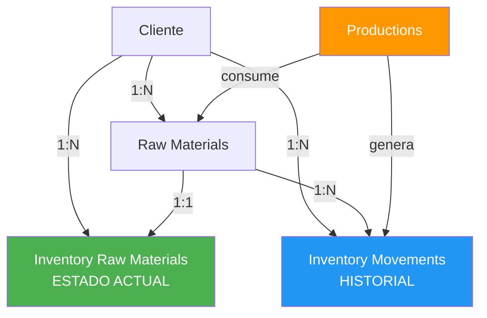
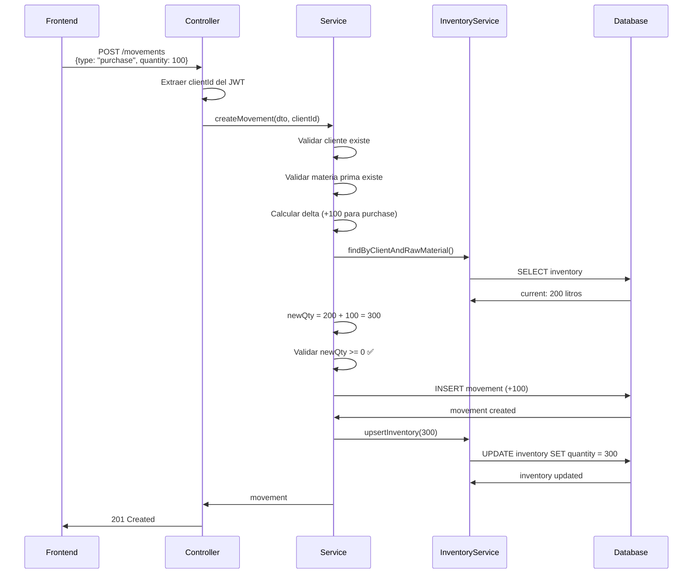

# 📦 Sistema de Inventario de Materias Primas - Documentación Completa

## 🎯 Concepto General

El sistema de inventario maneja **dos aspectos fundamentales**:

1. **Estado Actual** (`inventory_raw_materials`): Cuánto hay disponible ahora
2. **Historial** (`inventory_raw_material_movements`): Qué pasó, cuándo y por qué

### **Regla de Oro**

> **Cada cambio en el inventario DEBE tener un movimiento registrado.**
> 
> Esto garantiza trazabilidad, auditoría y la capacidad de reconstruir el inventario en cualquier momento.

---

## 📊 Estructura de Datos

### **Tabla: `inventory_raw_materials`**

Almacena el **estado actual** del inventario.

| Campo | Tipo | Descripción |
|-------|------|-------------|
| `id` | BigInt | ID único del registro |
| `client_id` | BigInt | Cliente propietario (multi-tenancy) |
| `raw_material_id` | BigInt | Materia prima |
| `quantity` | Decimal | Cantidad actual disponible |
| `unit` | String | Unidad de medida (litros, kg, etc.) |
| `updated_at` | DateTime | Última actualización |

**Ejemplo:**

| raw_material_id | name | quantity | unit |
|----------------|------|----------|------|
| 1 | Leche | 200.00 | litros |
| 2 | Sal | 4.50 | kg |

---

### **Tabla: `inventory_raw_material_movements`**

Almacena el **historial detallado** de todos los movimientos.

| Campo | Tipo | Descripción |
|-------|------|-------------|
| `id` | UUID | ID único del movimiento |
| `client_id` | BigInt | Cliente propietario |
| `raw_material_id` | BigInt | Materia prima afectada |
| `type` | String | Tipo de movimiento (ver tipos abajo) |
| `quantity` | Decimal | Cantidad del movimiento (+ entrada, - salida) |
| `unit` | String | Unidad de medida |
| `reference_id` | UUID | Referencia externa (producción, compra, etc.) |
| `notes` | String | Notas adicionales |
| `created_at` | DateTime | Fecha del movimiento |

**Ejemplo:**

| type | quantity | unit | notes | created_at |
|------|----------|------|-------|------------|
| purchase | +100.00 | litros | Compra semanal | 2025-11-28 10:00 |
| production_usage | -30.00 | litros | Producción #202 | 2025-11-28 14:30 |
| adjustment | -2.00 | litros | Derrame | 2025-11-28 16:00 |

---

## 🔄 Tipos de Movimientos

### **1. `purchase` (Compra)**

**Descripción:** Entrada de materia prima por compra.

**Efecto:** ✅ Suma al inventario

**Uso:**
- Compras a proveedores
- Recepciones de mercancía

**Ejemplo:**
```json
{
  "raw_material_id": 1,
  "type": "purchase",
  "quantity": 100,
  "unit": "litros",
  "notes": "Compra semanal proveedor XYZ"
}
```

---

### **2. `initial_load` (Carga Inicial)**

**Descripción:** Carga del inventario inicial cuando el cliente empieza a usar Gestora.

**Efecto:** ✅ Suma al inventario

**Uso:**
- Primera vez que se registra una materia prima
- Migración de datos de otro sistema

**Ejemplo:**
```json
{
  "raw_material_id": 1,
  "type": "initial_load",
  "quantity": 70,
  "unit": "litros",
  "notes": "Inventario inicial al comenzar a usar Gestora"
}
```

---

### **3. `adjustment` (Ajuste Manual)**

**Descripción:** Ajuste manual del inventario (positivo o negativo).

**Efecto:** ✅ Suma (si positivo) o ❌ Resta (si negativo)

**Uso:**
- Correcciones de inventario
- Pérdidas (derrames, vencimientos)
- Ganancias (devoluciones, encontrados)

**Ejemplo - Pérdida:**
```json
{
  "raw_material_id": 1,
  "type": "adjustment",
  "quantity": -5,
  "unit": "litros",
  "notes": "Derrame en almacén"
}
```

**Ejemplo - Corrección:**
```json
{
  "raw_material_id": 2,
  "type": "adjustment",
  "quantity": 2,
  "unit": "kg",
  "notes": "Corrección por conteo físico"
}
```

---

### **4. `production_usage` (Consumo en Producción)**

**Descripción:** Consumo automático de materias primas en una producción.

**Efecto:** ❌ Resta del inventario

**Uso:**
- Automático cuando se crea una producción
- El sistema lo registra basándose en `production_materials`

**Ejemplo:**
```json
{
  "raw_material_id": 1,
  "type": "production_usage",
  "quantity": 30,
  "unit": "litros",
  "reference_id": "uuid-de-produccion",
  "notes": "Consumo en producción lote 2025-11-28"
}
```

---

## 🔄 Flujo de Datos

### **Diagrama de Relaciones**



### **Flujo de un Movimiento**



---

## 🔌 API Endpoints

### **Inventario Actual**

#### **GET `/api/inventory-raw-materials`**

Obtener el inventario actual del cliente.

**Headers:**
```
Authorization: Bearer <JWT_TOKEN>
```

**Query Params:**
- `raw_material_id` (opcional): Filtrar por materia prima

**Response:**
```json
[
  {
    "id": "1",
    "client_id": "1",
    "raw_material_id": "1",
    "quantity": "200.00",
    "unit": "litros",
    "updated_at": "2025-11-28T10:00:00Z",
    "raw_materials": {
      "id": "1",
      "name": "Leche",
      "status": "active"
    }
  }
]
```

---

#### **GET `/api/inventory-raw-materials/:id`**

Obtener un registro específico de inventario.

**Headers:**
```
Authorization: Bearer <JWT_TOKEN>
```

**Response:**
```json
{
  "id": "1",
  "client_id": "1",
  "raw_material_id": "1",
  "quantity": "200.00",
  "unit": "litros",
  "updated_at": "2025-11-28T10:00:00Z",
  "raw_materials": {
    "id": "1",
    "name": "Leche",
    "status": "active"
  }
}
```

---

#### **POST `/api/inventory-raw-materials`**

⚠️ **Raramente usado.** Crear un registro de inventario manualmente.

Normalmente el inventario se crea automáticamente con el primer movimiento.

**Headers:**
```
Authorization: Bearer <JWT_TOKEN>
```

**Body:**
```json
{
  "raw_material_id": 1,
  "quantity": 100,
  "unit": "litros"
}
```

---

### **Movimientos**

#### **POST `/api/inventory-raw-material-movements`**

**Registrar un movimiento de inventario.**

Este es el endpoint principal para todas las operaciones de inventario.

**Headers:**
```
Authorization: Bearer <JWT_TOKEN>
```

**Body:**
```json
{
  "raw_material_id": 1,
  "type": "purchase",
  "quantity": 100,
  "unit": "litros",
  "notes": "Compra semanal"
}
```

**Validaciones:**
- ✅ Cliente existe
- ✅ Materia prima existe y pertenece al cliente
- ✅ Cantidad > 0
- ✅ Para salidas: inventario suficiente

**Response:**
```json
{
  "id": "uuid",
  "client_id": "1",
  "raw_material_id": "1",
  "type": "purchase",
  "quantity": "100.00",
  "unit": "litros",
  "notes": "Compra semanal",
  "created_at": "2025-11-28T10:00:00Z"
}
```

**Errores Posibles:**

```json
// Inventario insuficiente
{
  "statusCode": 400,
  "message": "Insufficient inventory. Current: 10 litros, Requested: 30 litros"
}
```

```json
// Cantidad inválida
{
  "statusCode": 400,
  "message": "Quantity must be greater than 0"
}
```

---

#### **GET `/api/inventory-raw-material-movements`**

Obtener el historial de movimientos.

**Headers:**
```
Authorization: Bearer <JWT_TOKEN>
```

**Query Params:**
- `raw_material_id` (opcional): Filtrar por materia prima
- `type` (opcional): Filtrar por tipo de movimiento (`purchase`, `adjustment`, `production_usage`, `initial_load`)

**Response:**
```json
[
  {
    "id": "uuid-1",
    "client_id": "1",
    "raw_material_id": "1",
    "type": "purchase",
    "quantity": "100.00",
    "unit": "litros",
    "notes": "Compra semanal",
    "created_at": "2025-11-28T10:00:00Z",
    "raw_materials": {
      "id": "1",
      "name": "Leche"
    }
  },
  {
    "id": "uuid-2",
    "client_id": "1",
    "raw_material_id": "1",
    "type": "production_usage",
    "quantity": "-30.00",
    "unit": "litros",
    "reference_id": "production-uuid",
    "notes": "Consumo en producción",
    "created_at": "2025-11-28T14:30:00Z",
    "raw_materials": {
      "id": "1",
      "name": "Leche"
    }
  }
]
```

---

## 💡 Casos de Uso

### **Caso 1: Compra de Materia Prima**

**Escenario:** El cliente compró 100 litros de leche.

**Acción:**
```bash
POST /api/inventory-raw-material-movements
Authorization: Bearer <TOKEN>
Content-Type: application/json
```

```json
{
  "raw_material_id": 1,
  "type": "purchase",
  "quantity": 100,
  "unit": "litros",
  "notes": "Compra proveedor XYZ - Factura #12345"
}
```

**Resultado:**
- ✅ Se crea un movimiento de tipo `purchase` con +100 litros
- ✅ El inventario actual aumenta de 200 a 300 litros

---

### **Caso 2: Derrame o Pérdida**

**Escenario:** Se derramaron 5 litros de leche.

**Acción:**
```bash
POST /api/inventory-raw-material-movements
```

```json
{
  "raw_material_id": 1,
  "type": "adjustment",
  "quantity": -5,
  "unit": "litros",
  "notes": "Derrame en almacén"
}
```

**Resultado:**
- ✅ Se crea un movimiento de tipo `adjustment` con -5 litros
- ✅ El inventario actual disminuye de 300 a 295 litros

---

### **Caso 3: Carga Inicial**

**Escenario:** El cliente empieza a usar Gestora y tiene 70 litros de leche en stock.

**Acción:**
```bash
POST /api/inventory-raw-material-movements
```

```json
{
  "raw_material_id": 1,
  "type": "initial_load",
  "quantity": 70,
  "unit": "litros",
  "notes": "Inventario inicial al comenzar a usar Gestora"
}
```

**Resultado:**
- ✅ Se crea un movimiento de tipo `initial_load` con +70 litros
- ✅ Se crea el registro de inventario con 70 litros (si no existía)

---

### **Caso 4: Consumo en Producción (Automático)**

**Escenario:** Se crea una producción que consume 30 litros de leche.

**Acción:** El sistema automáticamente llama a:
```typescript
inventoryMovementsService.registerProductionConsumption(
  clientId,
  rawMaterialId: 1n,
  quantity: 30,
  unit: 'litros',
  productionId: 'uuid-de-produccion',
  notes: 'Consumo en producción lote 2025-11-28'
);
```

**Resultado:**
- ✅ Se crea un movimiento de tipo `production_usage` con -30 litros
- ✅ El inventario actual disminuye de 295 a 265 litros
- ✅ El movimiento queda vinculado a la producción (`reference_id`)

---

## ⚠️ Validaciones Implementadas

### **1. Inventario No Negativo**

```typescript
if (newQty < 0) {
  throw new BadRequestException(
    `Insufficient inventory. Current: ${currentQty} ${unit}, Requested: ${quantity} ${unit}`
  );
}
```

**Ejemplo de Error:**
```json
{
  "statusCode": 400,
  "message": "Insufficient inventory. Current: 10 litros, Requested: 30 litros"
}
```

---

### **2. Cantidad Positiva**

```typescript
if (quantity <= 0) {
  throw new BadRequestException('Quantity must be greater than 0');
}
```

---

### **3. Materia Prima Pertenece al Cliente**

```typescript
await this.rawMaterialsService.findOne(rawMaterialId, clientId);
// Lanza ForbiddenException si no pertenece al cliente
```

---

### **4. Cliente Existe**

```typescript
await this.clientsService.findOne(clientId);
// Lanza NotFoundException si no existe
```

---

## 🔗 Integración con Producción

### **Flujo Completo**

1. **Usuario crea una producción** que requiere:
   - 30 litros de leche
   - 0.5 kg de sal

2. **El módulo de producción:**
   - Crea el registro de producción
   - Crea registros en `production_materials`

3. **Por cada materia prima consumida:**
   ```typescript
   await inventoryMovementsService.registerProductionConsumption(
     clientId,
     rawMaterialId,
     quantity,
     unit,
     productionId,
     `Consumo en producción ${productionId}`
   );
   ```

4. **El sistema de inventario:**
   - Valida que hay suficiente stock
   - Crea el movimiento de tipo `production_usage`
   - Actualiza el inventario actual
   - Vincula el movimiento a la producción (`reference_id`)

---

## 📈 Escalabilidad Futura

### **Funcionalidades Planeadas**

1. **Módulo de Compras:**
   - Crear órdenes de compra
   - Al recibir la compra → generar movimiento `purchase` automáticamente
   - Vincular con `reference_id` a la orden de compra

2. **Reportes de Eficiencia:**
   - Calcular rendimiento: kg de leche → kg de queso
   - Identificar desperdicios
   - Optimizar costos

3. **Alertas de Stock Bajo:**
   - Configurar niveles mínimos por materia prima
   - Notificar cuando el inventario esté bajo
   - Sugerir reabastecimiento

4. **Auditoría Completa:**
   - Reconstruir inventario en cualquier fecha
   - Reportes de movimientos por período
   - Análisis de tendencias

---

## 🎓 Resumen para Desarrolladores

### **Patrón Multi-Tenancy**

✅ **DTOs:** No incluyen `client_id` (viene del JWT)
✅ **Controllers:** Extraen `clientId` de `req.user.clientId`
✅ **Services:** Reciben `clientId` como parámetro
✅ **Validaciones:** Siempre verifican que los recursos pertenecen al cliente

### **Lógica de Negocio**

✅ **Movimientos:** Siempre crean un registro en `inventory_raw_material_movements`
✅ **Inventario:** Se actualiza automáticamente con cada movimiento
✅ **Validación:** Inventario nunca puede ser negativo
✅ **Trazabilidad:** Cada movimiento tiene tipo, cantidad, fecha y notas

### **Tipos de Movimiento**

| Tipo | Efecto | Uso |
|------|--------|-----|
| `purchase` | ➕ Entrada | Compras |
| `initial_load` | ➕ Entrada | Carga inicial |
| `adjustment` | ➕/➖ Ambos | Ajustes manuales |
| `production_usage` | ➖ Salida | Consumo en producción |

---

## 📚 Archivos del Sistema

### **DTOs:**
- `src/inventory_raw_materials/dto/create-inventory-raw-material.dto.ts`
- `src/inventory_raw_materials/dto/update-inventory-raw-material.dto.ts`
- `src/inventory_raw_material_movements/dto/create-inventory-raw-material-movement.dto.ts`

### **Services:**
- `src/inventory_raw_materials/inventory_raw_materials.service.ts`
- `src/inventory_raw_material_movements/inventory_raw_material_movements.service.ts`

### **Controllers:**
- `src/inventory_raw_materials/inventory_raw_materials.controller.ts`
- `src/inventory_raw_material_movements/inventory_raw_material_movements.controller.ts`

### **Modules:**
- `src/inventory_raw_materials/inventory_raw_materials.module.ts`
- `src/inventory_raw_material_movements/inventory_raw_material_movements.module.ts`

---

## 🧪 Pruebas con Swagger

1. Inicia el servidor:
   ```bash
   npm run start:dev
   ```

2. Abre Swagger UI:
   ```
   http://localhost:3000/api
   ```

3. Autentícate:
   - Usa el endpoint `/auth/login` para obtener un JWT token
   - Haz clic en "Authorize" y pega el token

4. Prueba los endpoints:
   - **Crear movimiento de compra:** `POST /api/inventory-raw-material-movements`
   - **Ver inventario actual:** `GET /api/inventory-raw-materials`
   - **Ver historial:** `GET /api/inventory-raw-material-movements`

---

## ✅ Verificación

```bash
npm run build
```

**Resultado:** ✅ Compilación exitosa sin errores

---

## 📞 Soporte

Para más información sobre la arquitectura multi-tenancy, consulta:
- `docs/arquitectura_multi_tenancy.md`
- `docs/correcciones_aplicadas.md`
