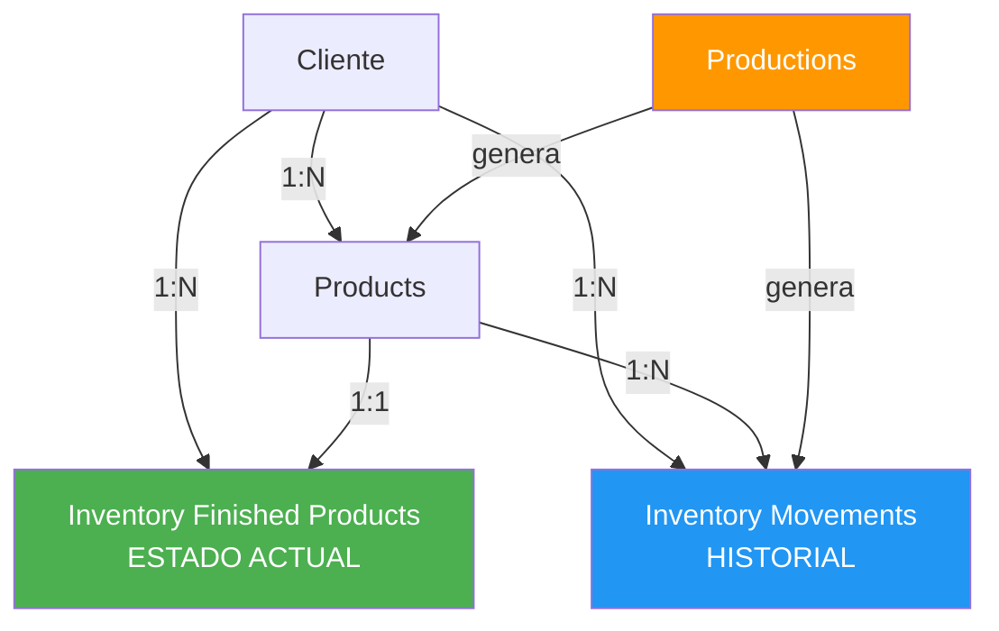
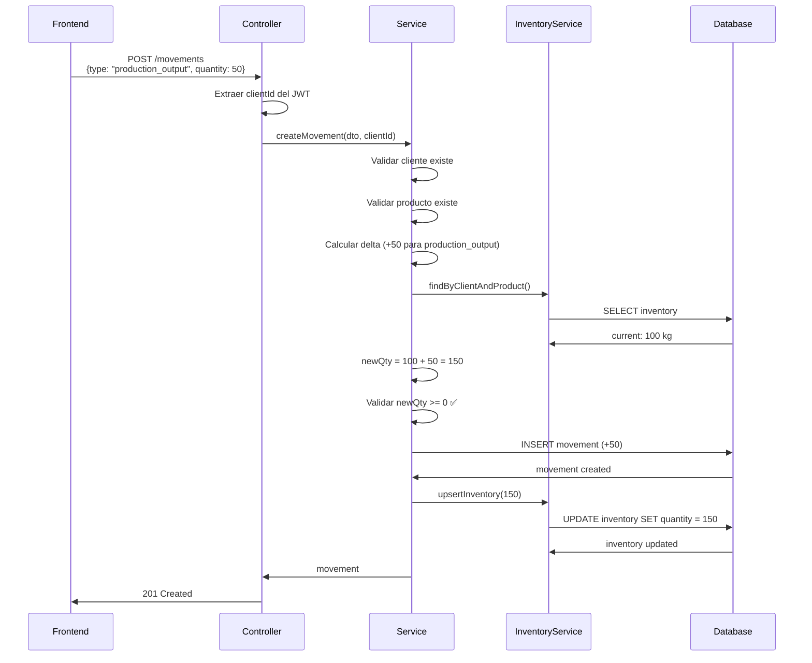

# 📦 Sistema de Inventario de Productos Terminados - Documentación Completa

## 🎯 Concepto General

El sistema de inventario de productos terminados maneja **dos aspectos fundamentales**:

1. **Estado Actual** (`inventory_finished_products`): Cuánto hay disponible ahora
2. **Historial** (`inventory_finished_product_movements`): Qué pasó, cuándo y por qué

### **Regla de Oro**

> **Cada cambio en el inventario DEBE tener un movimiento registrado.**
> 
> Esto garantiza trazabilidad, auditoría y la capacidad de reconstruir el inventario en cualquier momento.

---

## 📊 Estructura de Datos

### **Tabla: `inventory_finished_products`**

Almacena el **estado actual** del inventario.

| Campo | Tipo | Descripción |
|-------|------|-------------|
| `id` | BigInt | ID único del registro |
| `client_id` | BigInt | Cliente propietario (multi-tenancy) |
| `product_id` | BigInt | Producto terminado |
| `quantity` | Decimal | Cantidad actual disponible |
| `unit` | String | Unidad de medida (litros, kg, etc.) |
| `updated_at` | DateTime | Última actualización |

**Ejemplo:**

| product_id | name | quantity | unit |
|------------|------|----------|------|
| 1 | Queso Fresco | 50.00 | kg |
| 2 | Yogurt Natural | 120.00 | litros |

---

### **Tabla: `inventory_finished_product_movements`**

Almacena el **historial detallado** de todos los movimientos.

| Campo | Tipo | Descripción |
|-------|------|-------------|
| `id` | UUID | ID único del movimiento |
| `client_id` | BigInt | Cliente propietario |
| `product_id` | BigInt | Producto afectado |
| `type` | String | Tipo de movimiento (ver tipos abajo) |
| `quantity` | Decimal | Cantidad del movimiento (+ entrada, - salida) |
| `unit` | String | Unidad de medida |
| `reference_id` | UUID | Referencia externa (producción, venta, etc.) |
| `notes` | String | Notas adicionales |
| `created_at` | DateTime | Fecha del movimiento |

**Ejemplo:**

| type | quantity | unit | notes | created_at |
|------|----------|------|-------|------------|
| production_output | +50.00 | kg | Producción lote 2025-12-01 | 2025-12-01 10:00 |
| sale | -10.00 | kg | Venta cliente ABC | 2025-12-01 14:30 |
| adjustment | -2.00 | kg | Producto dañado | 2025-12-01 16:00 |

---

## 🔄 Tipos de Movimientos

### **1. `production_output` (Salida de Producción)**

**Descripción:** Entrada de producto terminado por producción.

**Efecto:** ✅ Suma al inventario

**Uso:**
- Producción de lotes
- Finalización de proceso productivo

**Ejemplo:**
```json
{
  "product_id": 1,
  "type": "production_output",
  "quantity": 50,
  "unit": "kg",
  "notes": "Producción lote 2025-12-01"
}
```

---

### **2. `sale` (Venta)**

**Descripción:** Salida de producto por venta.

**Efecto:** ❌ Resta del inventario

**Uso:**
- Ventas a clientes
- Entregas de pedidos

**Ejemplo:**
```json
{
  "product_id": 1,
  "type": "sale",
  "quantity": 10,
  "unit": "kg",
  "notes": "Venta cliente ABC - Factura #12345"
}
```

---

### **3. `adjustment` (Ajuste Manual)**

**Descripción:** Ajuste manual del inventario (positivo o negativo).

**Efecto:** ✅ Suma (si positivo) o ❌ Resta (si negativo)

**Uso:**
- Correcciones de inventario
- Pérdidas (productos dañados, vencidos)
- Ganancias (devoluciones, encontrados)

**Ejemplo - Pérdida:**
```json
{
  "product_id": 1,
  "type": "adjustment",
  "quantity": -3,
  "unit": "kg",
  "notes": "Producto dañado en almacén"
}
```

**Ejemplo - Corrección:**
```json
{
  "product_id": 2,
  "type": "adjustment",
  "quantity": 5,
  "unit": "litros",
  "notes": "Corrección por conteo físico"
}
```

---

### **4. `initial_load` (Carga Inicial)**

**Descripción:** Carga del inventario inicial cuando el cliente empieza a usar Gestora.

**Efecto:** ✅ Suma al inventario

**Uso:**
- Primera vez que se registra un producto
- Migración de datos de otro sistema

**Ejemplo:**
```json
{
  "product_id": 1,
  "type": "initial_load",
  "quantity": 30,
  "unit": "kg",
  "notes": "Inventario inicial al comenzar a usar Gestora"
}
```

---

## 🔄 Flujo de Datos

### **Diagrama de Relaciones**



### **Flujo de un Movimiento**



---

## 🔌 API Endpoints

### **Inventario Actual**

#### **GET `/api/inventory-finished-products`**

Obtener el inventario actual del cliente.

**Headers:**
```
Authorization: Bearer <JWT_TOKEN>
```

**Query Params:**
- `product_id` (opcional): Filtrar por producto

**Response:**
```json
[
  {
    "id": "1",
    "client_id": "1",
    "product_id": "1",
    "quantity": "50.00",
    "unit": "kg",
    "updated_at": "2025-12-01T10:00:00Z",
    "products": {
      "id": "1",
      "name": "Queso Fresco",
      "status": "active"
    }
  }
]
```

---

#### **GET `/api/inventory-finished-products/:id`**

Obtener un registro específico de inventario.

**Headers:**
```
Authorization: Bearer <JWT_TOKEN>
```

**Response:**
```json
{
  "id": "1",
  "client_id": "1",
  "product_id": "1",
  "quantity": "50.00",
  "unit": "kg",
  "updated_at": "2025-12-01T10:00:00Z",
  "products": {
    "id": "1",
    "name": "Queso Fresco",
    "status": "active"
  }
}
```

---

#### **POST `/api/inventory-finished-products`**

⚠️ **Raramente usado.** Crear un registro de inventario manualmente.

Normalmente el inventario se crea automáticamente con el primer movimiento.

**Headers:**
```
Authorization: Bearer <JWT_TOKEN>
```

**Body:**
```json
{
  "product_id": 1,
  "quantity": 50,
  "unit": "kg"
}
```

---

### **Movimientos**

#### **POST `/api/inventory-finished-product-movements`**

**Registrar un movimiento de inventario.**

Este es el endpoint principal para todas las operaciones de inventario.

**Headers:**
```
Authorization: Bearer <JWT_TOKEN>
```

**Body:**
```json
{
  "product_id": 1,
  "type": "production_output",
  "quantity": 50,
  "unit": "kg",
  "notes": "Producción lote 2025-12-01"
}
```

**Validaciones:**
- ✅ Cliente existe
- ✅ Producto existe y pertenece al cliente
- ✅ Cantidad > 0
- ✅ Para salidas: inventario suficiente

**Response:**
```json
{
  "id": "uuid",
  "client_id": "1",
  "product_id": "1",
  "type": "production_output",
  "quantity": "50.00",
  "unit": "kg",
  "notes": "Producción lote 2025-12-01",
  "created_at": "2025-12-01T10:00:00Z"
}
```

**Errores Posibles:**

```json
// Inventario insuficiente
{
  "statusCode": 400,
  "message": "Insufficient inventory. Current: 5 kg, Requested: 10 kg"
}
```

```json
// Cantidad inválida
{
  "statusCode": 400,
  "message": "Quantity must be greater than 0"
}
```

---

#### **GET `/api/inventory-finished-product-movements`**

Obtener el historial de movimientos.

**Headers:**
```
Authorization: Bearer <JWT_TOKEN>
```

**Query Params:**
- `product_id` (opcional): Filtrar por producto
- `type` (opcional): Filtrar por tipo de movimiento (`production_output`, `sale`, `adjustment`, `initial_load`)

**Response:**
```json
[
  {
    "id": "uuid-1",
    "client_id": "1",
    "product_id": "1",
    "type": "production_output",
    "quantity": "50.00",
    "unit": "kg",
    "notes": "Producción lote 2025-12-01",
    "created_at": "2025-12-01T10:00:00Z",
    "products": {
      "id": "1",
      "name": "Queso Fresco"
    }
  },
  {
    "id": "uuid-2",
    "client_id": "1",
    "product_id": "1",
    "type": "sale",
    "quantity": "-10.00",
    "unit": "kg",
    "notes": "Venta cliente ABC",
    "created_at": "2025-12-01T14:30:00Z",
    "products": {
      "id": "1",
      "name": "Queso Fresco"
    }
  }
]
```

---

## 💡 Casos de Uso

### **Caso 1: Salida de Producción**

**Escenario:** Se terminó una producción de 50 kg de queso fresco.

**Acción:**
```bash
POST /api/inventory-finished-product-movements
Authorization: Bearer <TOKEN>
Content-Type: application/json
```

```json
{
  "product_id": 1,
  "type": "production_output",
  "quantity": 50,
  "unit": "kg",
  "notes": "Producción lote 2025-12-01"
}
```

**Resultado:**
- ✅ Se crea un movimiento de tipo `production_output` con +50 kg
- ✅ El inventario actual aumenta de 100 a 150 kg

---

### **Caso 2: Venta de Producto**

**Escenario:** Se vendieron 10 kg de queso fresco al cliente ABC.

**Acción:**
```bash
POST /api/inventory-finished-product-movements
```

```json
{
  "product_id": 1,
  "type": "sale",
  "quantity": 10,
  "unit": "kg",
  "notes": "Venta cliente ABC - Factura #12345"
}
```

**Resultado:**
- ✅ Se crea un movimiento de tipo `sale` con -10 kg
- ✅ El inventario actual disminuye de 150 a 140 kg

---

### **Caso 3: Producto Dañado**

**Escenario:** Se dañaron 3 kg de queso fresco.

**Acción:**
```bash
POST /api/inventory-finished-product-movements
```

```json
{
  "product_id": 1,
  "type": "adjustment",
  "quantity": -3,
  "unit": "kg",
  "notes": "Producto dañado en almacén"
}
```

**Resultado:**
- ✅ Se crea un movimiento de tipo `adjustment` con -3 kg
- ✅ El inventario actual disminuye de 140 a 137 kg

---

### **Caso 4: Carga Inicial**

**Escenario:** El cliente empieza a usar Gestora y tiene 30 kg de queso fresco en stock.

**Acción:**
```bash
POST /api/inventory-finished-product-movements
```

```json
{
  "product_id": 1,
  "type": "initial_load",
  "quantity": 30,
  "unit": "kg",
  "notes": "Inventario inicial al comenzar a usar Gestora"
}
```

**Resultado:**
- ✅ Se crea un movimiento de tipo `initial_load` con +30 kg
- ✅ Se crea el registro de inventario con 30 kg (si no existía)

---

## ⚠️ Validaciones Implementadas

### **1. Inventario No Negativo**

```typescript
if (newQty < 0) {
  throw new BadRequestException(
    `Insufficient inventory. Current: ${currentQty} ${unit}, Requested: ${quantity} ${unit}`
  );
}
```

**Ejemplo de Error:**
```json
{
  "statusCode": 400,
  "message": "Insufficient inventory. Current: 5 kg, Requested: 10 kg"
}
```

---

### **2. Cantidad Positiva**

```typescript
if (quantity <= 0) {
  throw new BadRequestException('Quantity must be greater than 0');
}
```

---

### **3. Producto Pertenece al Cliente**

```typescript
await this.productsService.findOne(productId, clientId);
// Lanza ForbiddenException si no pertenece al cliente
```

---

### **4. Cliente Existe**

```typescript
await this.clientsService.findOne(clientId);
// Lanza NotFoundException si no existe
```

---

## 🔗 Integración con Producción

### **Flujo Completo**

1. **Usuario crea una producción** que genera:
   - 50 kg de queso fresco

2. **El módulo de producción:**
   - Crea el registro de producción
   - Crea registros en `production_products`

3. **Por cada producto generado:**
   ```typescript
   await inventoryMovementsService.registerProductionOutput(
     clientId,
     productId,
     quantity,
     unit,
     productionId,
     `Salida de producción ${productionId}`
   );
   ```

4. **El sistema de inventario:**
   - Valida que el producto existe
   - Crea el movimiento de tipo `production_output`
   - Actualiza el inventario actual
   - Vincula el movimiento a la producción (`reference_id`)

---

## 📈 Escalabilidad Futura

### **Funcionalidades Planeadas**

1. **Módulo de Ventas:**
   - Crear órdenes de venta
   - Al confirmar la venta → generar movimiento `sale` automáticamente
   - Vincular con `reference_id` a la orden de venta

2. **Reportes de Inventario:**
   - Productos más vendidos
   - Rotación de inventario
   - Análisis de tendencias

3. **Alertas de Stock Bajo:**
   - Configurar niveles mínimos por producto
   - Notificar cuando el inventario esté bajo
   - Sugerir producción

4. **Auditoría Completa:**
   - Reconstruir inventario en cualquier fecha
   - Reportes de movimientos por período
   - Análisis de pérdidas y mermas

---

## 🎓 Resumen para Desarrolladores

### **Patrón Multi-Tenancy**

✅ **DTOs:** No incluyen `client_id` (viene del JWT)
✅ **Controllers:** Extraen `clientId` de `req.user.clientId`
✅ **Services:** Reciben `clientId` como parámetro
✅ **Validaciones:** Siempre verifican que los recursos pertenecen al cliente

### **Lógica de Negocio**

✅ **Movimientos:** Siempre crean un registro en `inventory_finished_product_movements`
✅ **Inventario:** Se actualiza automáticamente con cada movimiento
✅ **Validación:** Inventario nunca puede ser negativo
✅ **Trazabilidad:** Cada movimiento tiene tipo, cantidad, fecha y notas

### **Tipos de Movimiento**

| Tipo | Efecto | Uso |
|------|--------|-----|
| `production_output` | ➕ Entrada | Producción |
| `sale` | ➖ Salida | Ventas |
| `adjustment` | ➕/➖ Ambos | Ajustes manuales |
| `initial_load` | ➕ Entrada | Carga inicial |

---

## 📚 Archivos del Sistema

### **DTOs:**
- `src/inventory_finished_products/dto/create-inventory-finished-product.dto.ts`
- `src/inventory_finished_products/dto/update-inventory-finished-product.dto.ts`
- `src/inventory_finished_product_movements/dto/create-inventory-finished-product-movement.dto.ts`

### **Services:**
- `src/inventory_finished_products/inventory_finished_products.service.ts`
- `src/inventory_finished_product_movements/inventory_finished_product_movements.service.ts`

### **Controllers:**
- `src/inventory_finished_products/inventory_finished_products.controller.ts`
- `src/inventory_finished_product_movements/inventory_finished_product_movements.controller.ts`

### **Modules:**
- `src/inventory_finished_products/inventory_finished_products.module.ts`
- `src/inventory_finished_product_movements/inventory_finished_product_movements.module.ts`

---

## 🧪 Pruebas con Swagger

1. Inicia el servidor:
   ```bash
   npm run start:dev
   ```

2. Abre Swagger UI:
   ```
   http://localhost:3000/api
   ```

3. Autentícate:
   - Usa el endpoint `/auth/login` para obtener un JWT token
   - Haz clic en "Authorize" y pega el token

4. Prueba los endpoints:
   - **Crear movimiento de producción:** `POST /api/inventory-finished-product-movements`
   - **Ver inventario actual:** `GET /api/inventory-finished-products`
   - **Ver historial:** `GET /api/inventory-finished-product-movements`

---

## ✅ Verificación

```bash
npm run build
```

**Resultado:** ✅ Compilación exitosa sin errores

---

## 📞 Soporte

Para más información sobre la arquitectura multi-tenancy, consulta:
- `SISTEMA_INVENTARIO_MATERIAS_PRIMAS.md`
- `documentacion-backend.md`
